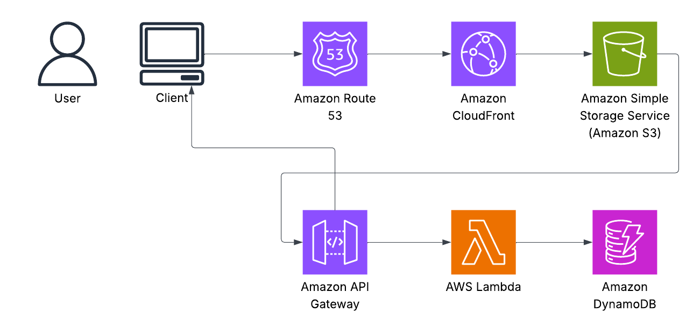
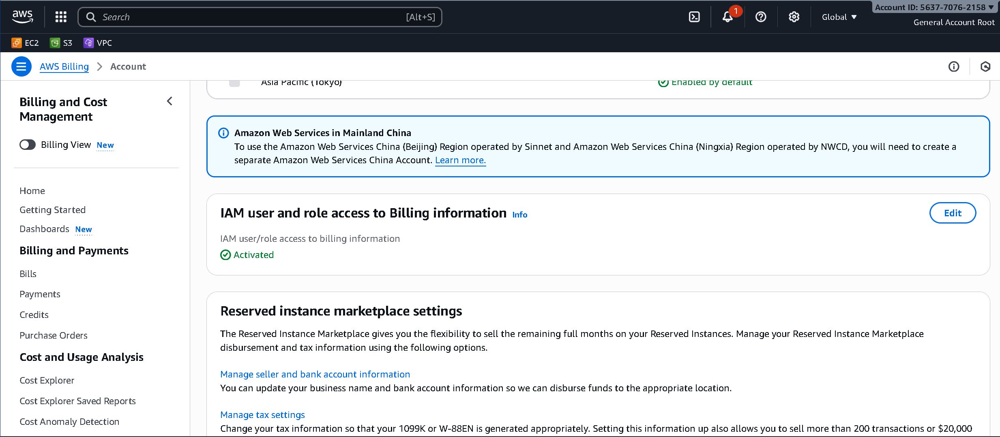

# 📘 Week 0 — Bootcamp Setup & Cloud Foundations  
**Bootcamp:** AWS Cloud Project Bootcamp  
**Student:** Robert  
**Week:** 0  
**Focus:** Account setup, billing protection, security hardening, basic architecture understanding.

**Summary:**  
This week I focused on securing my AWS account, setting up billing protections, reviewing the Cruddur architecture, and preparing my GitHub repo structure so I’m fully ready for the rest of the bootcamp.

---

# ✅ What I Completed This Week

### **AWS Account & Security Setup**
- Enabled MFA on the root account  
- Removed any root access keys  
- Verified IAM admin user access  
- Successfully switched regions in the AWS console  
- Verified AWS CLI access from CloudShell  

---

### **Billing Protection / Cost Controls**
- Created AWS Budgets  
- Set up cost alerts via SNS  
- Reviewed Cost Explorer  
- Reviewed monthly billing reports  

---

### **Architecture Basics & Tools**
- Watched architecture overview  
- Reviewed Cruddur project goals  
- Watched Lucidchart training video  
- Enabled AWS icons in Lucidchart  
- Created my first draft architectural diagram (v1)  

---

### **Project Prep**
- Confirmed access to live classes  
- Set up my GitHub repo structure  
- Created `/journal` directory  
- Created week-based folders  
- Prepared homework tracker  

---

# 🚧 Obstacles & How I Solved Them

### **1. Understanding correct root cleanup**
I had questions about removing credentials vs. disabling them.  
**Solution:** Verified via AWS docs that the root account should have *no access keys* at all and must have MFA.

### **2. Billing alerts confusing at first**
Different screens for Budgets vs Billing Alarms.  
**Solution:** Followed the class video to create both — Budget thresholds + CloudWatch Alarm.

### **3. Lucidchart AWS shapes not visible**
**Solution:** Enabled AWS shape library manually under “Shapes”.

*(Replace or add your own actual obstacles here.)*

---

# 🧪 Homework Challenges (Optional Stretch Work)

### These support Level-4 scores and Red Squad status:

- [ ] EventBridge → Health Dashboard → SNS integration  
- [ ] Rotated / destroyed root credentials  
- [ ] Reviewed *all* Well-Architected Pillar questions  
- [ ] Created a CI/CD logical pipeline diagram in Lucid  
- [ ] Researched AWS service limits & requested one limit increase  

## 📸 Screenshots

### **AWS SNS Subscription Email Notification**

### **CloudWatch Describe Alarm**

### **Monthly Cost Budget Setup**

### **Cruddur Conceptual Napkin Diagram**

### **Infrastructure Diagram**

### **Logical Architecture Diagram**

### **Role Access to Billing Information**

### **STS Get Caller Identity**

