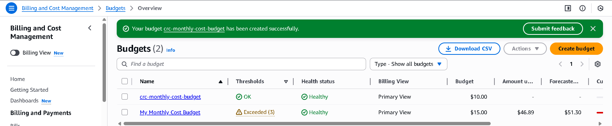
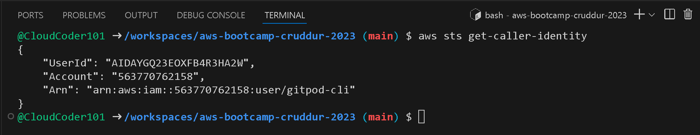
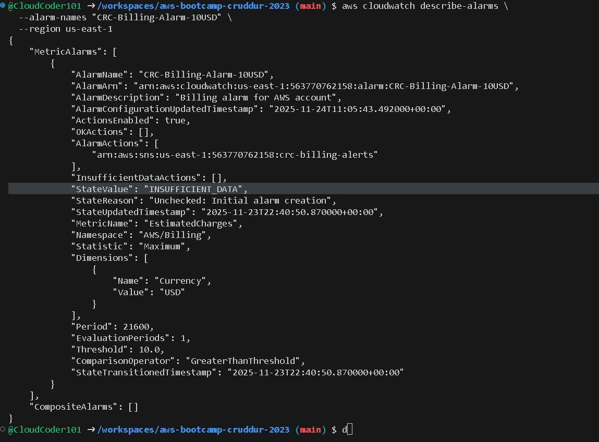
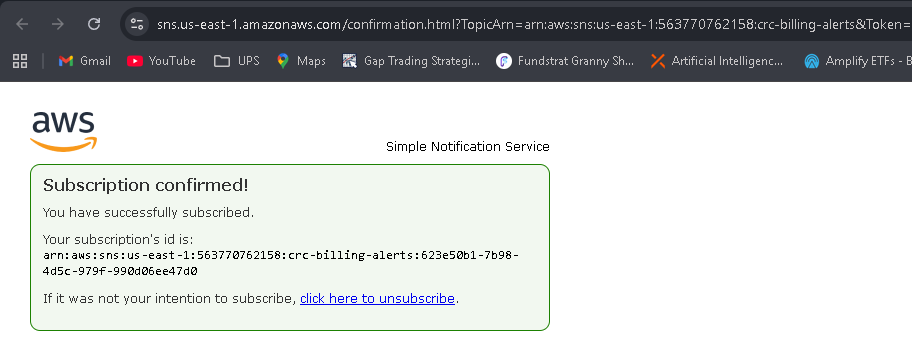

# Week 0 — Foundations, Setup, and Verification

This week focused on preparing my AWS account, establishing security best practices,
configuring the AWS CLI, and documenting proof of each step.

---

## 1. AWS Account Setup & Billing Protections

### Role Access to Billing
I verified that IAM User access to billing is enabled so I can view budgets and cost reports.


### Monthly Cost Budget
Created a monthly cost budget with email alerting configured.



---

## 2. AWS CLI Installation & Identity Verification

Installed AWS CLI, configured credentials with MFA enforced, and verified identity
using STS.

**Command:**
```bash
aws sts get-caller-identity
```

**Proof:**



---

## 3. CloudWatch Alarm & SNS Notifications

### CloudWatch Alarm
Created a CloudWatch alarm for budget notifications and verified alarm details.



### SNS Email Subscription
Configured an SNS topic and confirmed the subscription via email.



---

## 4. Architecture Diagrams (Conceptual → Logical → Infrastructure)

### Conceptual Diagram
High-level overview of the Crudder application and its major components.


### Logical Architecture
Shows hop-by-hop communication between services and how requests flow through the stack.


### Infrastructure Diagram
Full AWS infrastructure view of how Crudder is deployed in my account.


---

## 5. Week 0 Reflections

- Turned on MFA and cleaned up the AWS account to be “bootcamp ready.”
- Added billing protections (budget + alarm + SNS) so I don’t get surprised by charges.
- Installed and verified the AWS CLI using `aws sts get-caller-identity`.
- Rebuilt my Week 0 diagrams and captured them as assets stored under `journal/assets/`.

I also created a `journal/backfill/` folder and a `markdown_playground.md` file to
practice Markdown so that my future journal entries are clearer and easier to grade.
