# Week 1 — App Containerization

This week focused on validating Docker installation, building container images for the Cruddur backend and frontend, 
and running them locally. This establishes the foundation for deploying containers in later weeks.

---

## 1. Docker Installation & Environment Validation

### Docker Version
Command:

    docker --version

Proof:  
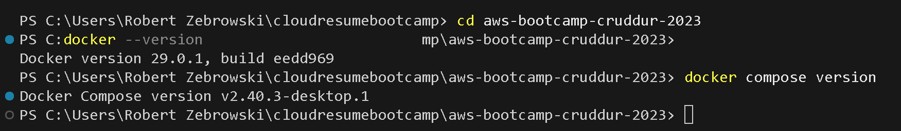

### Docker Compose Version
Command:

    docker compose version

Proof:  

### Docker Desktop / Engine Running
I verified that Docker Desktop (or Docker Engine) is running properly.

Proof:  
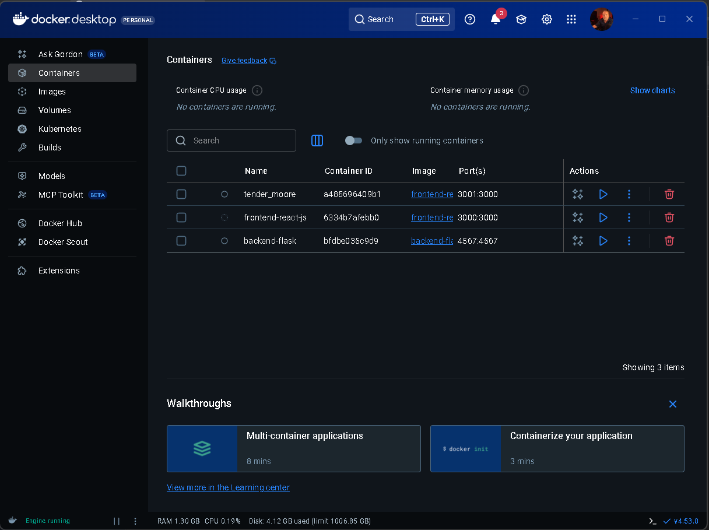

---

## 2. Backend (Flask) Containerization

### Build Backend Image
Commands:

    cd backend-flask
    docker build -t cruddur-backend .

Proof:  
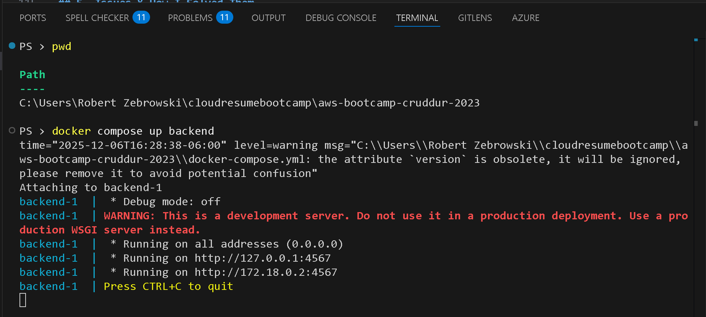

### Run Backend Container
Command:

    docker run --rm -p 4567:4567 --name cruddur-backend cruddur-backend

Proof:  
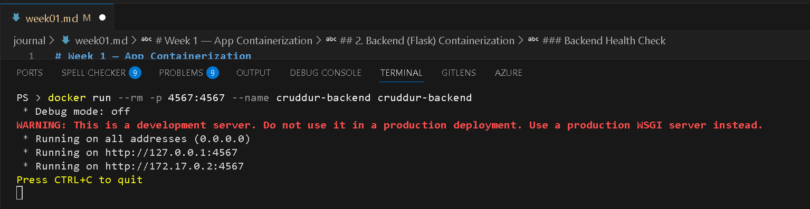

### Backend Health Check
Command:

    curl http://localhost:4567/health

Proof:  
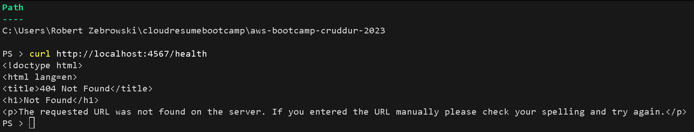

---

## 3. Frontend (React) Containerization

### Build Frontend Image
Commands:

    cd frontend-react-js
    docker build -t cruddur-frontend .

Proof:  
### Step 10 — Frontend Build

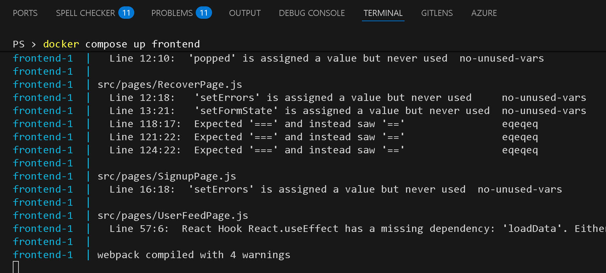
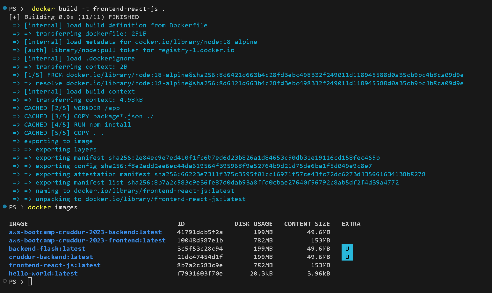

### Run Frontend Container
Command:

    docker run --rm -p 3001:3000 --name cruddur-frontend cruddur-frontend

Proof:  
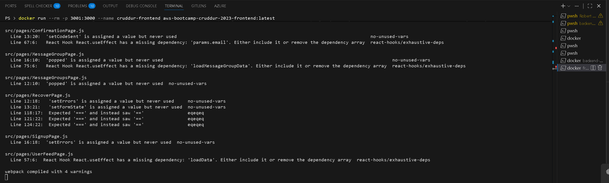
                           
### Verify UI in Browser
URL:

    http://localhost:3001

Proof:  
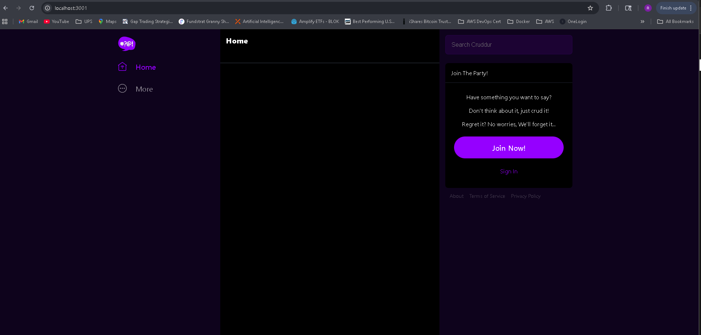

---

## 4. Working with Images & Containers

### List Local Images
Command:

    docker images

Proof:  
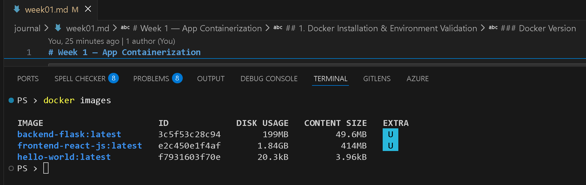

### List Containers
Commands:

    docker ps
    docker ps -a

Proof:  
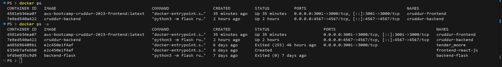

---

## 5. Issues & How I Solved Them

### Issue 1 — Port Conflict on 3000

When running the frontend container, local port **3000** was already in use by **Grafana**, causing the container to fail and the UI to not load.

**Solution:**  

- Ran `netstat -ano | findstr :3000` to check which process was using port 3000.  
  - Output showed:  
    - `TCP 0.0.0.0:3000` → listening on all interfaces  
    - `PID 11784` → process using the port  
- Ran `tasklist /FI "PID eq 11784"` to identify the exact program.  
  - Result: `Grafana.exe`
- Since Grafana must stay on port 3000, I changed the frontend container run command to:
  
      docker run -p 3001:3000 ...

  This forwards:
  - **Host port 3001 → Container port 3000**

- The frontend UI became available at:  
  **http://localhost:3001**

This resolved the entire issue.

---

## 6. What I Learned This Week

- **Docker images vs. containers:**  
  Docker images are built from Dockerfiles and act as read-only blueprints, while containers are the running, active instances created from those images.  
  *(Images are like a bag of groceries — containers are the meal you cook and eat.)*

- **How to build Docker images** using `docker build` and verify them using `docker images`.

- **How to run containers** with `docker run`, map ports, and inspect running processes with `docker ps`.

- **How to troubleshoot port conflicts** using `netstat -ano | findstr` and `tasklist` on Windows.

- **How to verify backend and frontend services**, including curl health checks and UI validation.

- **How containerization prepares the project for AWS:**  
  With both services running cleanly in Docker, they are ready for ECS, ECR, and automated deployments in later weeks.

---

**Week 1 App Containerization: Complete**
