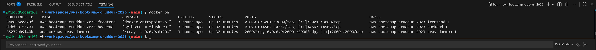
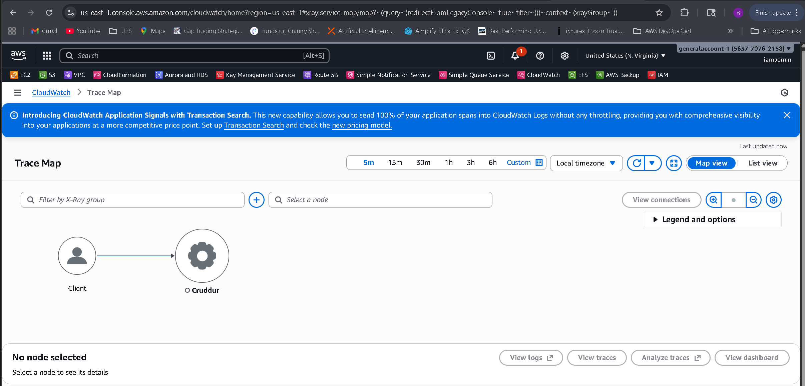
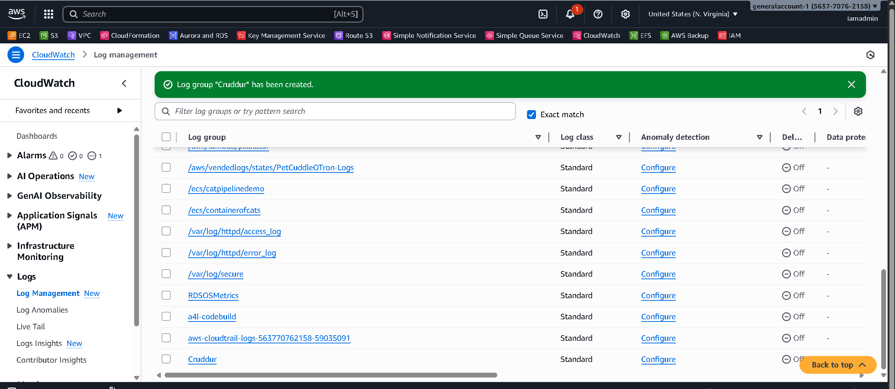
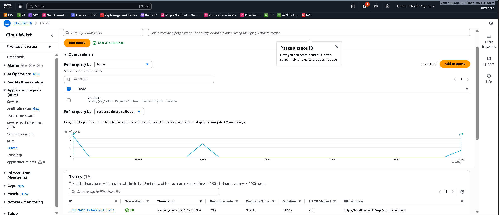
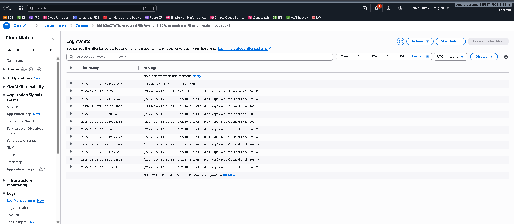
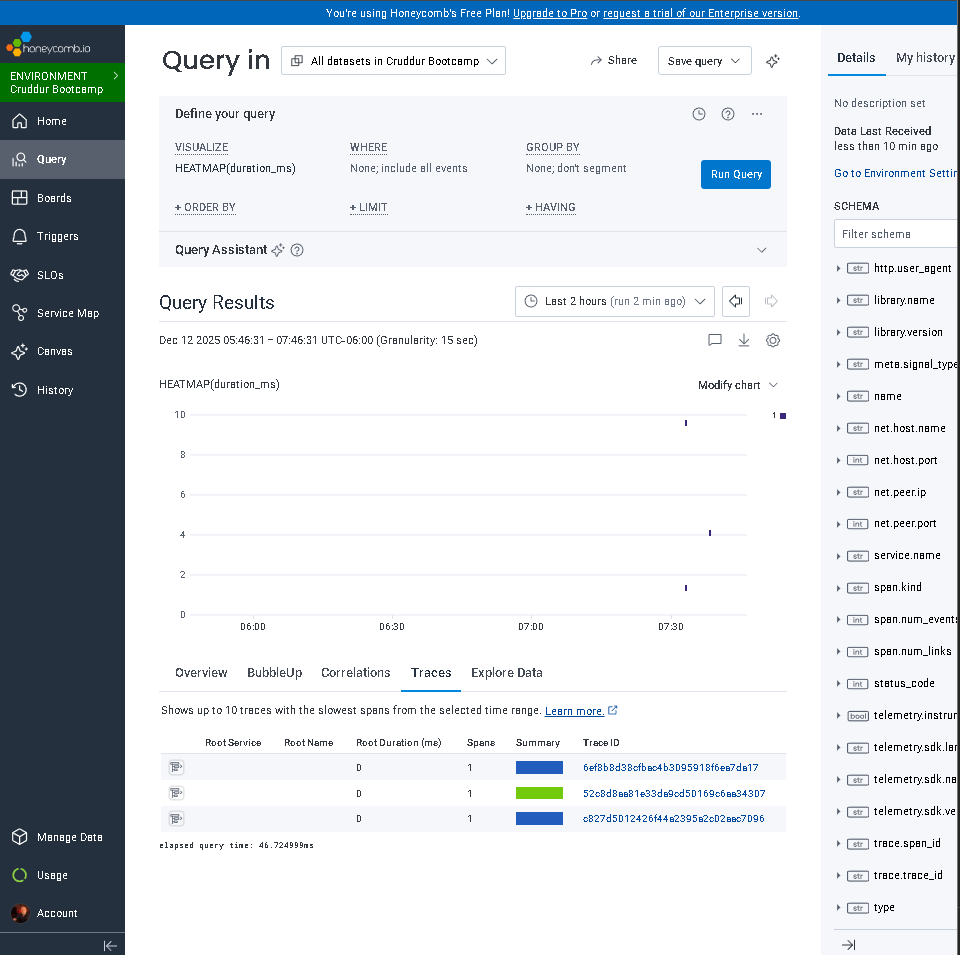
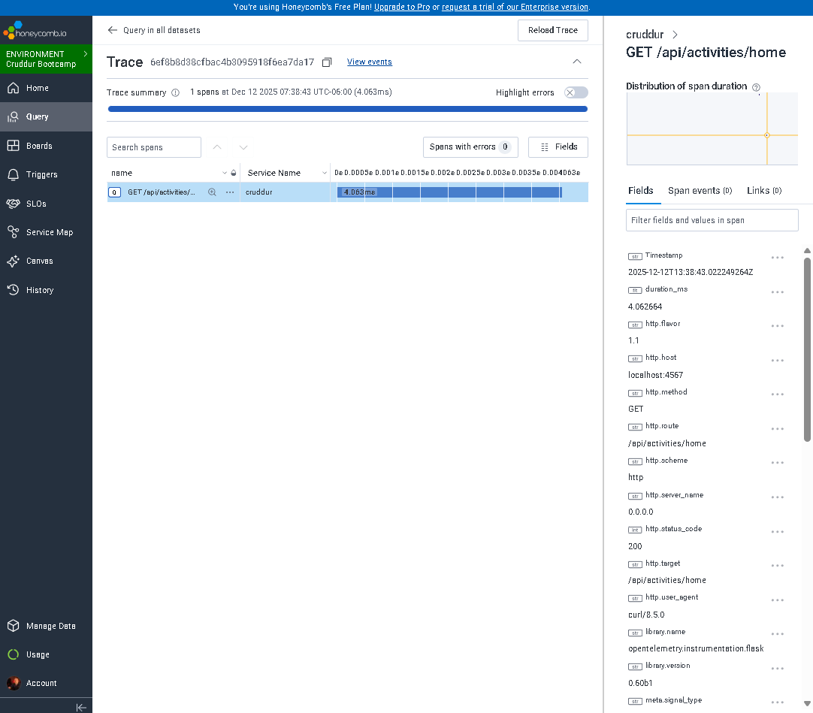
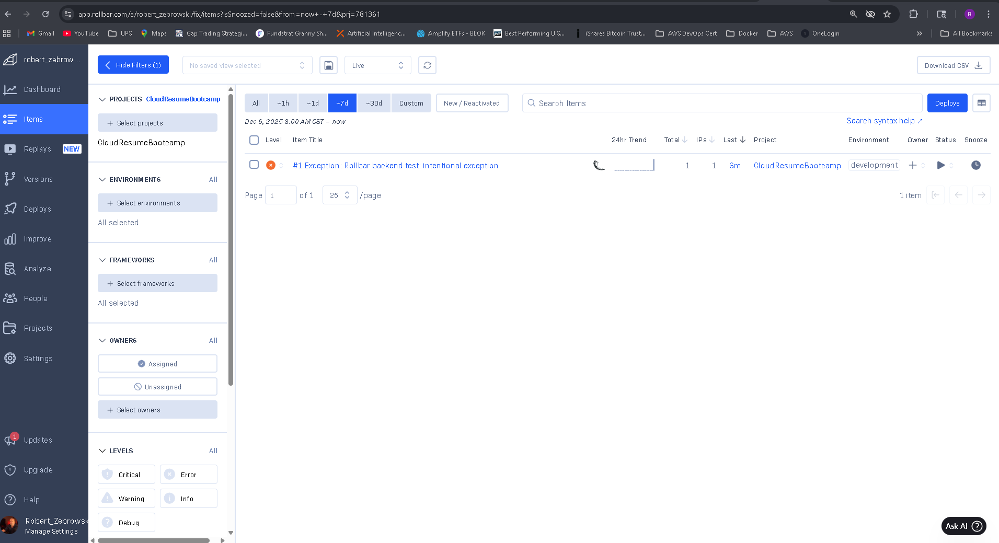

# Week 2 — Distributed Tracing

This week focused on adding distributed tracing, logging, and error reporting to the Cruddur application using **AWS X-Ray**, **Honeycomb (OpenTelemetry)**, **CloudWatch Logs**, and **Rollbar**.

---

## 1. AWS X-Ray — Distributed Tracing for Flask

### Set Region
```bash
export AWS_REGION="us-east-1"
```

### Install Dependencies
Add to `requirements.txt`:
```
aws-xray-sdk
```

Install:
```bash
pip install -r requirements.txt
```

### Add Middleware to `app.py`
```python
from aws_xray_sdk.core import xray_recorder
from aws_xray_sdk.ext.flask.middleware import XRayMiddleware

xray_url = os.getenv("AWS_XRAY_URL")
xray_recorder.configure(service='Cruddur', dynamic_naming=xray_url)
XRayMiddleware(app, xray_recorder)
```

### Create `aws/json/xray.json`
```json
{
  "SamplingRule": {
    "RuleName": "Cruddur",
    "ResourceARN": "*",
    "Priority": 9000,
    "FixedRate": 0.1,
    "ReservoirSize": 5,
    "ServiceName": "Cruddur",
    "ServiceType": "*",
    "Host": "*",
    "HTTPMethod": "*",
    "URLPath": "*",
    "Version": 1
  }
}
```

### Create X-Ray Group and Sampling Rule
```bash
FLASK_ADDRESS="https://4567-${CODESPACE_NAME}.${GITHUB_CODESPACES_PORT_FORWARDING_DOMAIN}"
aws xray create-group \
  --group-name "Cruddur" \
  --filter-expression "service(\"$FLASK_ADDRESS\") {fault OR error}" \
  --region us-east-1

aws xray create-sampling-rule \
  --cli-input-json file://aws/json/xray.json \
  --region us-east-1
```

---

## 2. Honeycomb — OpenTelemetry Tracing

### Add Dependencies
```
opentelemetry-api
opentelemetry-sdk
opentelemetry-exporter-otlp-proto-http
opentelemetry-instrumentation-flask
opentelemetry-instrumentation-requests
```

### Add Tracing to `app.py`
```python
from opentelemetry import trace
from opentelemetry.instrumentation.flask import FlaskInstrumentor
from opentelemetry.instrumentation.requests import RequestsInstrumentor
from opentelemetry.exporter.otlp.proto.http.trace_exporter import OTLPSpanExporter
from opentelemetry.sdk.trace import TracerProvider
from opentelemetry.sdk.trace.export import BatchSpanProcessor

provider = TracerProvider()
processor = BatchSpanProcessor(OTLPSpanExporter())
provider.add_span_processor(processor)
trace.set_tracer_provider(provider)

FlaskInstrumentor().instrument_app(app)
RequestsInstrumentor().instrument()
```

---

## 3. CloudWatch Logs

### Add Dependency
```
watchtower
```

### Add Logging to `app.py`
```python
import watchtower
import logging
from time import strftime

LOGGER = logging.getLogger(__name__)
LOGGER.setLevel(logging.DEBUG)
LOGGER.addHandler(logging.StreamHandler())
LOGGER.addHandler(watchtower.CloudWatchLogHandler(log_group='cruddur'))
```

---

## 4. Rollbar — Backend Error Tracking

### Add Dependencies
```
blinker
rollbar
```

### Initialize Rollbar
```python
import rollbar
import rollbar.contrib.flask
from flask import got_request_exception

rollbar.init(
    access_token=os.getenv("ROLLBAR_ACCESS_TOKEN"),
    environment="development",
    root=os.path.dirname(os.path.realpath(__file__))
)

got_request_exception.connect(
    rollbar.contrib.flask.report_exception,
    app
)
```

### Test Endpoint
```python
@app.route("/rollbar/test")
def rollbar_test():
    raise Exception("Rollbar backend test: intentional exception")
```

---

## Proof Screenshots (Week 02)












---

## ✅ Week 2 Distributed Tracing: Complete


