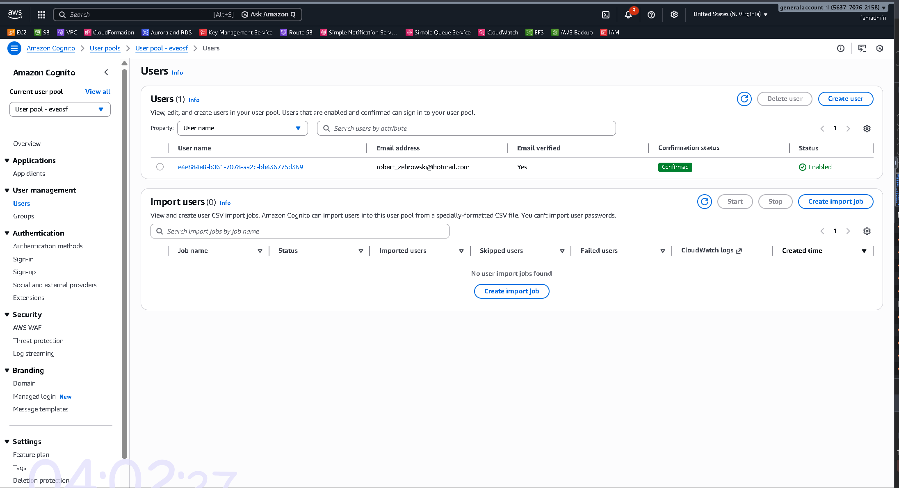
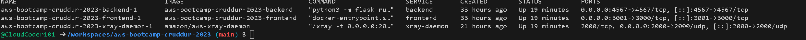
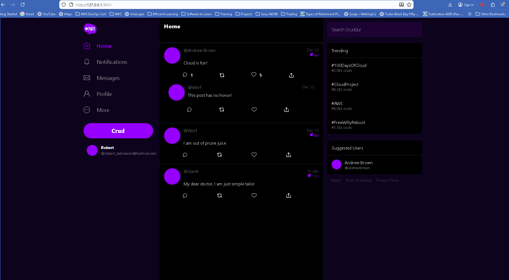

# Week 3 — Decentralized Authentication
## Journal

### Overview
This week focused on adding decentralized authentication to the Cruddur application using Amazon Cognito. The goal was to allow users to sign up, confirm their account, log in, and remain authenticated while interacting with the application. This required integrating Cognito with the frontend and ensuring the backend could support authenticated requests.

---

### Key Implementation
- Configured an Amazon Cognito User Pool and application client.
- Integrated AWS Amplify authentication into the React frontend.
- Updated the application to track authenticated user state.
- Modified frontend pages to conditionally render content based on login status.
- Ensured the backend was reachable and running alongside the authenticated      frontend.

---

### Issues Encountered and Fixes
- **Authentication state not persisting:**  
  Initially, the app did not reliably recognize logged-in users after page refreshes. This was resolved by properly checking the authenticated user state during application startup.

- **Frontend routing and auth flow issues:**  
  Signup and confirmation pages did not behave correctly at first. Fixing component logic and navigation flow resolved these issues.

- **Environment configuration mismatches:**  
  Some authentication settings did not work as expected due to mismatched environment variables. Verifying and aligning frontend configuration fixed the problem.

- **Local container verification:**  
  Confirmed that Docker containers were running correctly to rule out backend connectivity issues during debugging.

---

### Verification
Authentication was verified by:
- Successfully signing up a new user and confirming the account in Cognito.
- Logging in and observing authenticated user state in the application.
- Running the application locally with Docker containers active.
- Confirming the frontend loaded correctly while authenticated.

Screenshots documenting verification are included under `journal/assets/week03/`.
#### Screenshots

- **Cognito user confirmed**
  
  

- **Docker containers running**
  
  

- **Application showing logged-in user**
  
  

---

### What I Learned
- How frontend authentication state drives application behavior.
- The importance of consistent environment configuration when integrating cloud services.
- How Cognito, Amplify, and React work together to manage user authentication.
- The value of verifying container health when debugging application issues.

---

