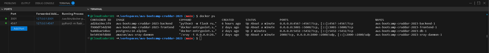
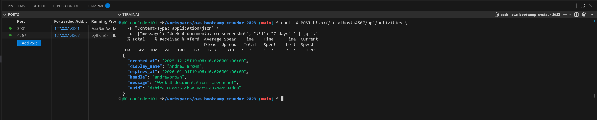
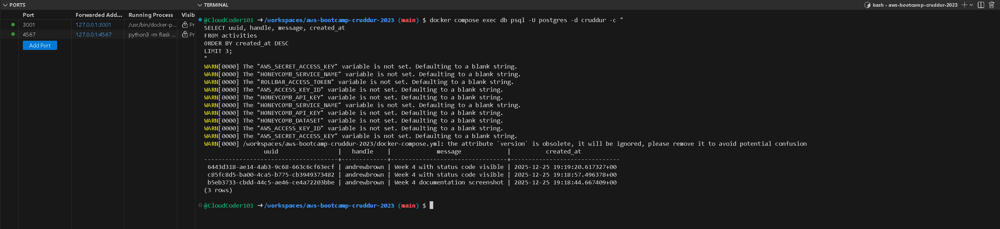
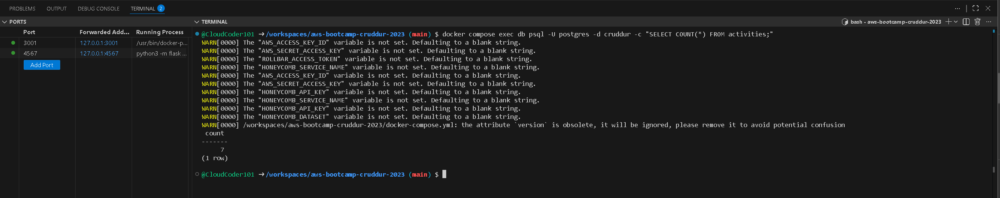
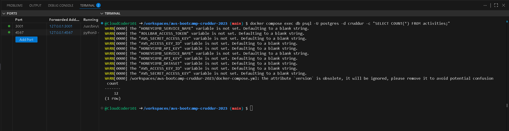

# Week 4 — Postgres and RDS
# Week 4: PostgreSQL Integration

## Objectives
- Integrate PostgreSQL database with Flask backend
- Implement CRUD operations (Create and Read)
- Connect frontend to backend API with database persistence

## Implementation

### Docker Setup
All services running in containers:



### Database Integration

#### Read Path (GET Endpoint)
Implemented `/api/activities/home` endpoint that queries PostgreSQL and returns activities with nested replies.


#### Write Path (POST Endpoint)
Implemented `/api/activities` endpoint that inserts new activities into PostgreSQL.

**Successful POST with 200 OK:**


**Database verification showing new row:**


### Verification of Database Writes

**Count before documentation:**


**Count after POST operations:**


Count increased from 7 to 12, confirming successful database writes and transaction commits.

## Key Challenges Resolved

### 1. Import Path Issue
- **Problem:** `from lib.db import db` (incorrect path)
- **Solution:** Changed to `from services.db import get_conn`

### 2. Schema Mismatch
- **Problem:** Code referenced `user_uuid` column which didn't exist
- **Solution:** Updated to use `handle` column matching actual schema

### 3. Docker Image Caching
- **Problem:** Code changes not reflected in container
- **Solution:** Used `docker compose up --build -d backend` to rebuild image

### 4. Transaction Commit
- **Problem:** INSERT executed but not committed to database
- **Solution:** Added explicit `conn.commit()` after successful INSERT

## Technical Details

### Database Schema
```sql
CREATE TABLE activities (
  uuid          UUID PRIMARY KEY DEFAULT gen_random_uuid(),
  handle        TEXT NOT NULL,
  message       TEXT NOT NULL,
  created_at    TIMESTAMP WITH TIME ZONE NOT NULL DEFAULT NOW(),
  expires_at    TIMESTAMP WITH TIME ZONE,
  likes_count   INTEGER NOT NULL DEFAULT 0,
  reposts_count INTEGER NOT NULL DEFAULT 0,
  replies_count INTEGER NOT NULL DEFAULT 0
);
```

### API Endpoints Implemented
- `GET /api/activities/home` - Returns all activities with replies
- `POST /api/activities` - Creates new activity

## Verification Commands
```bash
# Check database count
docker compose exec db psql -U postgres -d cruddur -c "SELECT COUNT(*) FROM activities;"

# Test POST endpoint
curl -i -X POST http://localhost:4567/api/activities \
  -H "Content-Type: application/json" \
  -d '{"message": "Test message", "ttl": "7-days"}'

# Test GET endpoint
curl http://localhost:4567/api/activities/home | jq '.[0]'
```

## Outcomes
✅ PostgreSQL successfully integrated with Flask backend
✅ Read operations returning data from database
✅ Write operations persisting to database
✅ Transaction commits working correctly
✅ Full CRUD API operational

## Next Steps
- Week 4 Part 2: Implement AWS Cognito authentication
- Week 5: Migrate to AWS RDS for production database