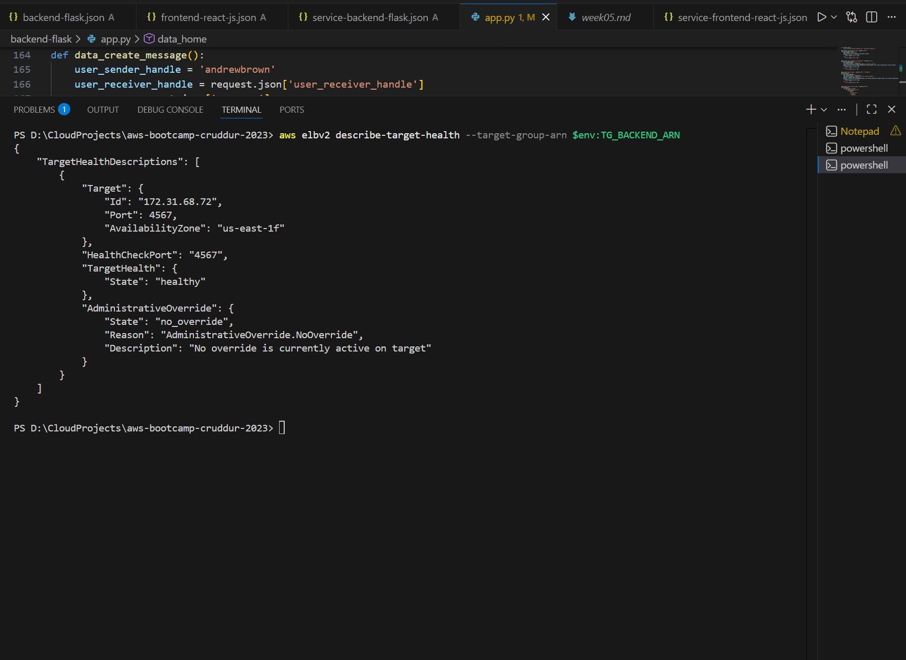
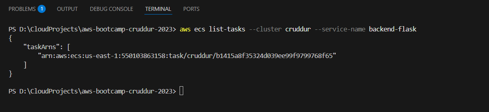
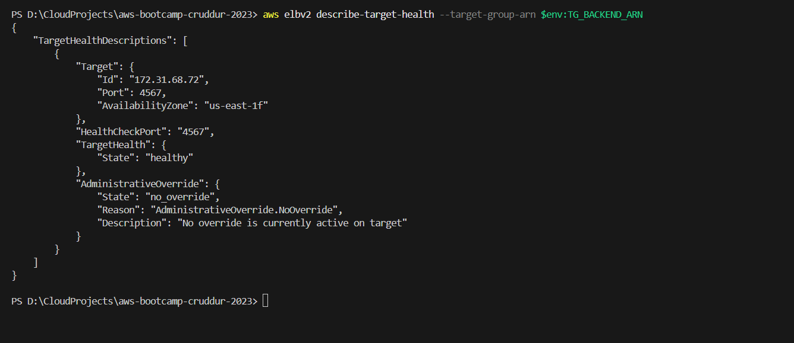
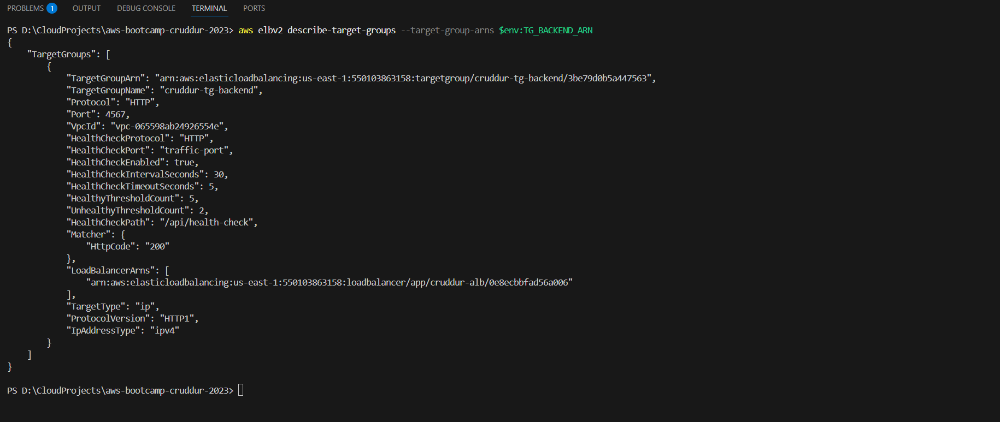

Week 06 — ECS + ALB Health Check Troubleshooting
Overview

This week focused on deploying the backend Flask service to ECS behind an Application Load Balancer (ALB) and troubleshooting why the service initially failed ALB health checks.

Although the ECS task itself appeared to be running, the ALB target group reported the backend as unhealthy or draining. Resolving this required validating the health check endpoint, reviewing ECS service events, checking container logs, and confirming security group rules between the ALB and ECS tasks.

Initial Symptom

After deployment, the backend ECS service started successfully, but the ALB target group showed the backend target as unhealthy.

The ECS console indicated tasks were running, but traffic was not successfully reaching the container through the ALB.

To confirm the ALB’s view of the backend, I checked the target group health status:

At this stage, the target was failing health checks and not considered ready to receive traffic.

ECS Service Events Review

Next, I reviewed the ECS service events to confirm whether ECS itself was encountering startup or deployment issues.

The service events showed tasks starting and stopping as expected, with no immediate container crash errors. This suggested that the problem was not a container startup failure but instead related to how the ALB was interacting with the running container.

Verifying Running Tasks

To ensure tasks were actually running and registered with the service, I listed the ECS tasks associated with the backend service.

At least one task was in a RUNNING state, confirming that ECS successfully launched the container. This further pointed to a load balancer or networking issue rather than a task definition or container failure.

Root Cause Investigation

At this point, I focused on the ALB health check configuration and the backend application behavior.

Key areas investigated:

Health check path (/api/health-check)

Expected response code (200)

Container port (4567)

Security group rules between the ALB and ECS tasks

The backend application was returning a 500 Internal Server Error on the health check endpoint when accessed by the ALB. This caused the ALB health checks to fail even though the container itself was running.

Additionally, I verified that the ECS service security group allowed inbound traffic from the ALB security group on port 4567.

Fix Applied

The following fixes were applied:

Corrected the backend Flask health check handler to consistently return an HTTP 200 response.

Ensured the health check endpoint did not depend on application state that could cause a 500 error.

Confirmed the ALB security group was allowed as an ingress source on port 4567 in the ECS task security group.

After redeploying the service with these fixes, the ALB target health status updated successfully.

The target transitioned to healthy, indicating that the ALB was now able to reach the backend container and receive a valid response.

Target Group Configuration Validation

Finally, I verified the target group configuration to ensure the health check settings matched the backend application behavior.

Key configuration points:

Protocol: HTTP

Port: traffic-port

Health check path: /api/health-check

Success codes: 200

These settings aligned with the backend application and confirmed the service was correctly configured.

Outcome

By validating ECS service state, reviewing service events, inspecting container health behavior, and confirming ALB security group access, I was able to resolve the health check failures.

The backend service now registers as healthy in the ALB target group and is able to receive traffic as expected.

Key Takeaways

A running ECS task does not guarantee ALB health check success.

ALB health checks depend on both application response codes and network permissions.

Reviewing ECS service events and ALB target group health together is critical when troubleshooting deployment issues.

✅ Status

Week 06 deployment complete and backend service verified healthy behind the ALB.

## Screenshots / Evidence

